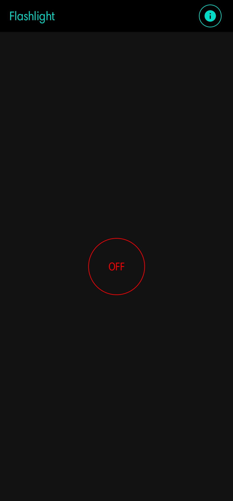
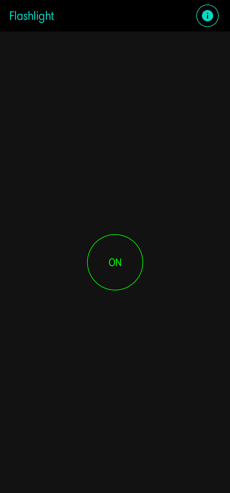
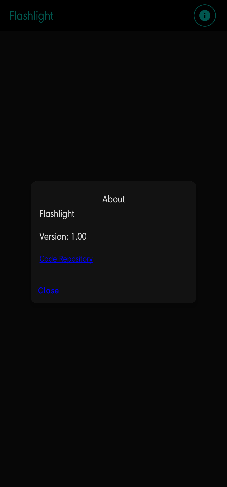
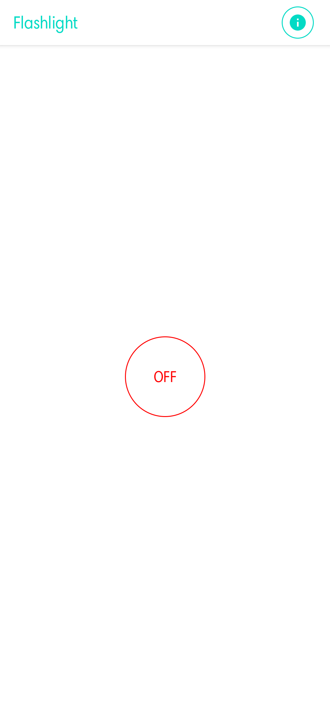
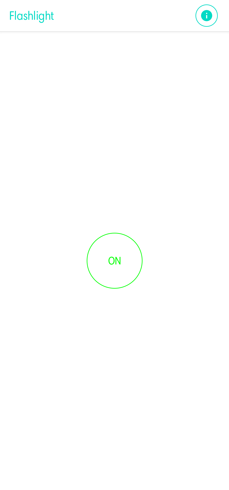

# Compose_Flashlight
A simple Android Flashlight app created using the newly available jetpack Compose tools. This project may or may not be updated frequently as
demonstrating Jetpack Compose code was the primary goal. 

## Play store

## Screenshots
<table>
  <tr>
    <td>

    </td>
    <td>

    </td>
    <td>

    </td>
  </tr>
  <tr>
    <td>

    </td>
    <td>

    </td>
  </tr>
</table>

Project License: Apache License 2.0  
Google Play and the Google Play logo are trademarks of Google LLC.
